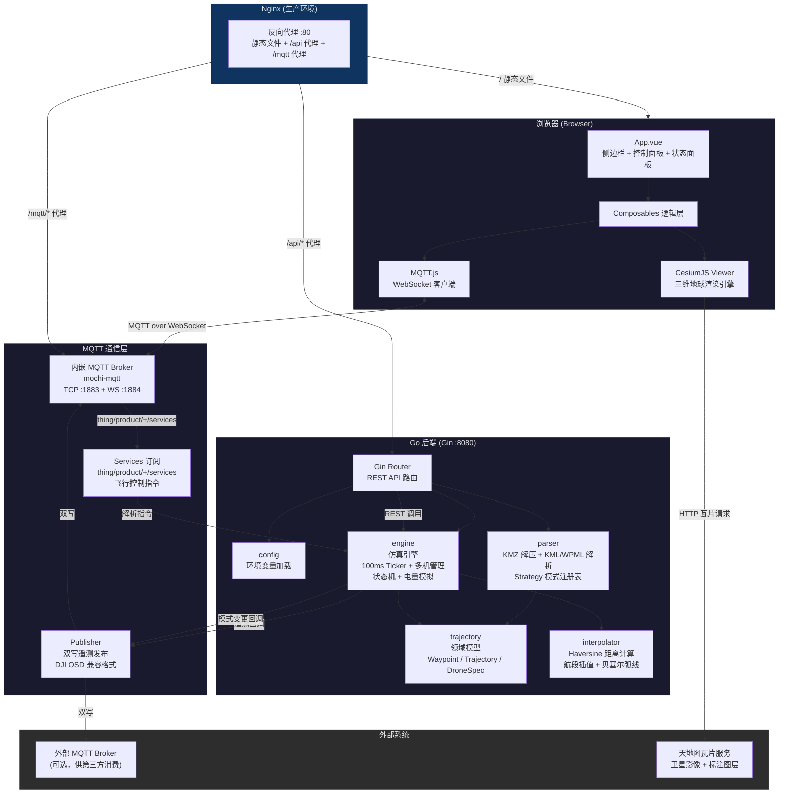

# 系统设计文档（SDD）— 工程模块说明 v1.0

> **文档状态:** 已定稿
> **版本:** v1.0
> **作者:** drone-sim 项目组
> **所属模块:** 全栈（前端 + 后端服务 + MQTT 通信）
> **创建日期:** 2026-07-24
> **关联PRD:** `.trae/specs/drone-route-sim/spec.md`

---

## 1. 模块概述

本系统是一个**无人机航线仿真与 Remote ID 可视化平台**。用户上传大疆 KMZ 航线文件后，后端解析航点数据并通过时间驱动的仿真引擎按照真实速度推进飞行状态，将遥测数据以 DJI Remote ID 兼容格式通过 MQTT 实时发布。前端基于 CesiumJS 在三维地球上实时展示无人机位置、姿态、飞行轨迹及完整状态面板。系统支持多机同时仿真，并提供仿真生命周期控制（开始/暂停/继续/停止/返航/倍速）。

### 1.1 模块定位与边界

- **模块名称**：无人机航线模拟与 Remote ID 可视化系统
- **核心职责**：解析 DJI KMZ 航线文件，以时间驱动方式仿真飞行过程，通过 MQTT 发布 DJI Remote ID 兼容遥测数据，在前端 3D 地球上实时可视化
- **上下游依赖**：
  - 上游：用户上传的 DJI KMZ 航线文件（WPML 格式）
  - 下游：外部系统可通过 MQTT Broker 订阅遥测数据；前端消费 REST API 和 MQTT 推送完成 3D 可视化
- **核心设计原则**：
  - **数据单向流动**：KMZ → 轨迹域模型 → 仿真引擎 → MQTT 推送 → 前端渲染，不逆流
  - **可扩展解析架构**：航线格式解析采用 Strategy 模式，新增格式只需实现接口并注册
  - **零外部依赖运行**：内嵌 MQTT Broker，无需单独安装 Mosquitto 等中间件

---

## 2. 技术架构与选型

| 层级/组件 | 技术选型及版本 | **选型理由** |
|:---|:---|:---|
| **前端框架 / 运行时** | Vue 3.5 + TypeScript 6.0 | Composition API 适合封装 Cesium 3D 逻辑（`useCesium`/`useTrajectory`/`useMQTT` 等组合式函数），TypeScript 保证前端类型安全 |
| **核心渲染/计算引擎** | CesiumJS 1.143 | 原生支持 WGS84 坐标系无需投影转换，内置 Entity API 可高效驱动实时位置更新，天地图作为底图替代国内不可用的 Cesium Ion |
| **后端框架** | Go 1.26 + Gin 1.12 | Go 天然支持高并发 goroutine 驱动多机仿真，Gin 提供高性能 HTTP 路由和中间件生态 |
| **实时通信协议** | MQTT 3.1.1（TCP + WebSocket） | 服务端以 10Hz（100ms）主动推送遥测数据，WebSocket 通道让浏览器直接订阅仿真状态；DJI 生态原生使用 MQTT，保持协议兼容 |
| **内嵌 MQTT Broker** | mochi-mqtt/server v2.7.9 | 编译进 Go 二进制，无需外部安装 Mosquitto，支持 TCP 和 WebSocket 双协议 |
| **MQTT 客户端** | Eclipse Paho MQTT v1.5（Go）/ mqtt.js v5.15（前端） | Go 端发布遥测并订阅飞行控制指令，浏览器端通过 WebSocket 订阅 `thing/product/+/osd` |
| **构建工具** | Vite 8 + vue-tsc | 极速 HMR 开发体验，`vite-plugin-cesium` 自动处理 Cesium 静态资源 |
| **数据存储** | 无持久化存储（纯内存仿真） | 航线数据在内存中保留，页面刷新后通过 `/api/sim/trajectories` 和 `/api/sim/status` 恢复状态 |
| **部署运行环境** | Windows / Linux，无 GPU 依赖 | Cesium 渲染在浏览器端完成，后端纯 CPU 数值计算，最低 4 核 / 8 GB 内存 |

---

## 3. 模块内部架构设计

### 3.1 分层 / 目录结构图

```
drone-sim/
├── backend/                          # Go 后端服务
│   ├── cmd/server/main.go            # [入口层] 组装依赖、注册路由、启动 MQTT Broker
│   └── internal/
│       ├── config/config.go          # [配置层] 加载 .env 环境变量
│       ├── parser/                   # [解析层] KMZ/WPML 文件解析
│       │   ├── parser.go             #   RouteParser 接口 + ParserRegistry 注册表
│       │   ├── registry.go           #   全局单例注册表
│       │   └── kmz.go                #   DJI KMZ 解析实现（ZIP→KML→WPML→Trajectory）
│       ├── trajectory/trajectory.go  # [领域模型层] Waypoint、Trajectory、RemoteIDTelemetry、DroneModelSpec
│       ├── engine/                   # [仿真引擎层] 时间驱动仿真核心
│       │   ├── engine.go             #   仿真引擎（ticker、多机管理、悬停/电量/返航逻辑）
│       │   └── interpolator.go       #   轨迹插值（Haversine 距离、贝塞尔弧线、线性插值）
│       └── mqtt/                     # [通信层] MQTT 发布与 Broker
│           ├── broker.go             #   内嵌 MQTT Broker（TCP :1883 + WS :1884）
│           └── publisher.go          #   遥测发布（DJI OSD 兼容格式）
├── frontend/                         # Vue 3 + TypeScript 前端
│   ├── src/
│   │   ├── main.ts                   # [入口] 挂载 Vue 应用 + Cesium CSS
│   │   ├── App.vue                   # [UI 层] 主界面（侧边栏 + Cesium 容器 + 控制面板）
│   │   ├── style.css                 # [样式] 完整深色主题
│   │   └── composables/              # [逻辑层] 组合式函数
│   │       ├── useCesium.ts          #   Cesium Viewer 初始化（天地图底图、相机位置）
│   │       ├── useTrajectory.ts      #   Cesium Entity 管理（无人机、轨迹线、航点标记）
│   │       ├── useMQTT.ts            #   MQTT WebSocket 客户端封装
│   │       └── useDebug.ts           #   Debug 模式（离线模拟，不依赖后端）
│   └── vite.config.ts                # Vite 配置 + /api 代理
└── nginx.conf                        # [部署层] 生产环境 Nginx 反向代理
```

### 3.2 系统框架图



### 3.3 核心模块 / 组件职责明细

| 组件/类名 | 文件路径 | 核心职责 | 关键依赖 |
|:---|:---|:---|:---|
| **RouteParser** | `backend/internal/parser/parser.go` | 定义航线解析接口 `Parse(reader, filename) → Trajectory` | Go `io.Reader` |
| **KMZParser** | `backend/internal/parser/kmz.go` | 解压 KMZ → 解析 `template.kml` + `waylines.wpml` → 合并生成 Trajectory | `archive/zip`, `encoding/xml` |
| **ParserRegistry** | `backend/internal/parser/parser.go` | 基于文件扩展名的解析器注册与查找（Strategy 模式） | 无 |
| **Trajectory** | `backend/internal/trajectory/trajectory.go` | 无人机航线的领域模型：航点序列、任务配置、机型规格 | 无 |
| **Engine** | `backend/internal/engine/engine.go` | 仿真核心：100ms ticker 推进、多机管理、飞行动作处理 | `interpolator` |
| **Interpolator** | `backend/internal/engine/interpolator.go` | Haversine 距离计算、航段插值、贝塞尔弧线转折、垂直速度计算 | `trajectory` |
| **EmbeddedBroker** | `backend/internal/mqtt/broker.go` | 内嵌 MQTT Broker 启动与生命周期管理 | `mochi-mqtt/server/v2` |
| **Publisher** | `backend/internal/mqtt/publisher.go` | DJI Remote ID 兼容格式遥测发布 + 设备状态同步 | `paho.mqtt.golang` |
| **useCesium** | `frontend/src/composables/useCesium.ts` | Cesium Viewer 初始化，配置天地图卫星底图和标注图层 | `cesium` |
| **useTrajectory** | `frontend/src/composables/useTrajectory.ts` | 管理所有 Cesium Entity（无人机箭头、轨迹线、航点标记、预览虚线） | `cesium`, `useCesium` |
| **useMQTT** | `frontend/src/composables/useMQTT.ts` | 浏览器 MQTT WebSocket 连接、订阅、消息分发 | `mqtt.js` |
| **App.vue** | `frontend/src/App.vue` | 主界面编排：文件上传、无人机列表、状态面板、控制按钮、状态恢复 | 所有 composables |

---

## 4. 核心数据流与交互时序

### 4.1 系统泳道时序图：上传 KMZ 并启动仿真

```mermaid
sequenceDiagram
    actor User as 用户
    participant UI as 前端 App.vue
    participant Cesium as 前端 Cesium Viewer
    participant MQTT_WS as 前端 MQTT.js
    participant Gin as 后端 Gin Router
    participant Parser as 后端 Parser
    participant Engine as 后端 Engine
    participant Pub as 后端 Publisher
    participant Broker as 内嵌 MQTT Broker
    participant Ext as 外部 MQTT Broker

    rect rgb(25, 25, 50)
        Note over User,Broker: ── 阶段一：上传 KMZ 与航线解析 ──
        User->>UI: 选择 .kmz 文件并点击上传
        UI->>Gin: POST /api/upload (multipart/form-data)
        Gin->>Parser: 遍历文件，ParserRegistry.FindParser(".kmz")
        Parser->>Parser: 解压 ZIP<br/>解析 wpmz/template.kml<br/>解析 wpmz/waylines.wpml
        Parser-->>Gin: 返回 Trajectory (航点序列 + 任务配置)
        Gin->>Engine: AddDrone(traj) 注册无人机
        Engine->>Engine: 构建仿真航点<br/>(起飞段 + 航线段 + 返航段)<br/>展开 coordinateTurn 贝塞尔弧线
        Engine-->>Gin: 返回 droneID
        Gin->>Pub: PublishDeviceOnline(droneID)
        Pub->>Broker: PUBLISH thing/product/{id}/state
        Pub->>Ext: PUBLISH thing/product/{id}/state
        Gin-->>UI: 200 {success, data: Trajectory[]}
        UI->>Cesium: addTrajectory() 绘制黄色虚线预览 + 航点标记
        UI->>MQTT_WS: subscribe("thing/product/{id}/osd")
        MQTT_WS->>Broker: SUBSCRIBE (WebSocket)
        Cesium-->>User: 显示航线预览，等待仿真开始
    end

    rect rgb(40, 25, 25)
        Note over User,Broker: ── 阶段二：启动仿真实时驱动 ──
        User->>UI: 点击"开始仿真"
        UI->>Gin: POST /api/sim/start {droneId}
        Gin->>Engine: Start(droneID)
        Engine->>Engine: 启动 goroutine<br/>100ms Ticker 循环
        Engine->>Pub: PublishModeChange(droneID, "running")
        Pub->>Broker: PUBLISH thing/product/{id}/state (mode=running)
        Pub->>Ext: PUBLISH thing/product/{id}/state
    end

    rect rgb(25, 40, 25)
        Note over User,Broker: ── 阶段三：实时仿真循环 (每 100ms) ──
        loop 每个 tick (100ms)
            Engine->>Engine: 插值器 Interpolate(elapsed)<br/>Haversine 计算当前位置/航向
            Engine->>Engine: 更新电池消耗、进度百分比
            Engine->>Pub: PublishTelemetry(RemoteIDTelemetry)
            Pub->>Broker: PUBLISH thing/product/{id}/osd
            Pub->>Ext: PUBLISH thing/product/{id}/osd
            Broker->>MQTT_WS: PUSH thing/product/{id}/osd
            MQTT_WS->>UI: 解析 OSD 遥测数据
            UI->>Cesium: updateDronePosition(lat, lng, height, heading)
            UI->>UI: 更新状态面板<br/>(速度/高度/电量/进度/航点)
            Cesium-->>User: 实时展示无人机位置 + 飞行轨迹线
        end
    end

    rect rgb(25, 25, 40)
        Note over User,Broker: ── 阶段四：仿真完成 ──
        Engine->>Engine: 到达最后一个航点
        Engine->>Pub: PublishModeChange(droneID, "stopped")
        Pub->>Broker: PUBLISH thing/product/{id}/state (mode=stopped)
        Broker->>MQTT_WS: PUSH thing/product/{id}/state
        MQTT_WS->>UI: 仿真完成
        UI-->>User: 无人机停止，状态面板显示"已完成"
    end
```



### 4.2 关键链路描述：上传 KMZ 并启动仿真

1. **触发动作**：用户在前端侧边栏选择 `.kmz` 文件并点击上传
2. **Step 1**：`App.vue` 通过 `POST /api/upload`（multipart/form-data）将文件发送到后端
3. **Step 2**：后端 `main.go` 遍历每个文件，根据扩展名从 `ParserRegistry` 查找解析器 → `KMZParser.Parse()` 解压 KMZ、解析 XML、合并生成 `Trajectory`
4. **Step 3**：调用 `Engine.AddDrone(traj)` 注册无人机，构建仿真航点序列（含起飞段、航线段、返航段），返回 `droneID`
5. **Step 4**：后端发布设备上线消息 → `thing/product/{droneID}/state`
6. **Step 5**：返回解析结果给前端，前端调用 `useTrajectory.addTrajectory()` 在地球上绘制黄色虚线预览 + 航点标记
7. **Step 6**：用户点击"开始" → `POST /api/sim/start` → `Engine.Start()` 启动 100ms goroutine 循环
8. **Step 7**：每个 tick，插值器计算当前位置 → `Publisher.PublishTelemetry()` 双写到外部和内部 Broker → 前端通过 MQTT WebSocket 接收 `thing/product/{id}/osd`
9. **最终呈现**：Cesium Entity 实时更新位置/朝向，青色实线轨迹渐次绘制，状态面板同步刷新

### 4.3 关键链路描述：仿真生命周期控制（暂停/继续/停止/返航/倍速）

1. **触发动作**：用户点击控制按钮
2. **Step 1**：前端发送 `POST /api/sim/{start|pause|resume|stop|speed}`
3. **Step 2**：`Engine` 更新对应无人机的状态机（idle → running → paused → stopped / returning）
4. **Step 3**：模式变更回调 `PublishModeChange()` 推送 `thing/product/{id}/state` + `thing/product/{id}/osd`
5. **前端响应**：状态面板更新状态文本和指示灯颜色，仿真暂停时无人机保持当前位置

> 另外，系统也支持通过 DJI 兼容的 MQTT 指令控制仿真：后端订阅 `thing/product/+/services`，接收 `flight_task_execute`/`pause`/`resume`/`terminate`/`return_home` 等 method，回复 `services_reply`。

### 4.4 通信协议定义（关键字段）

**MQTT DJI OS D 遥测格式** — 主题 `thing/product/{droneId}/osd`：

```json
{
  "tid": "UUID (事务ID)",
  "bid": "UUID (业务ID)",
  "timestamp": 1710000000000,
  "gateway": "{droneId}",
  "data": {
    "latitude": 22.531 (float, WGS84 度),
    "longitude": 113.935 (float, WGS84 度),
    "height": 120.0 (float, 椭球高度, 米),
    "altitude": 100.0 (float, 海拔高度 EGM96, 米),
    "attitude_head": 45.0 (float, 航向角, 度),
    "attitude_pitch": 0.0 (float, 俯仰角),
    "attitude_roll": 0.0 (float, 横滚角),
    "horizontal_speed": 15.0 (float, 水平速度, m/s),
    "vertical_speed": 2.0 (float, 垂直速度, m/s),
    "gps_number": 16 (int, GPS 星数),
    "battery": {
      "capacity_percent": 85 (int, 剩余电量百分比),
      "voltage": 46800 (int, 电压 mV),
      "temperature": 35.0 (float, 温度 ℃)
    },
    "position_state": {
      "is_fixed": 1 (int, 0=无定位 1=单点 2=RTK固定),
      "quality": 5 (int),
      "rtk_number": 0
    },
    "wayline": {
      "current_waypoint_index": 3 (int, 当前目标航点索引),
      "total_waypoint_count": 10 (int, 总航点数),
      "progress_percent": 35.0 (float, 航线完成百分比),
      "is_hovering": false (bool, 是否在悬停)
    },
    "flight_status": 1 (int, 0=待命 1=飞行中 2=暂停 3=返航 4=降落),
    "mode_code": 11 (int)
  }
}
```

**REST API 仿真状态 GET /api/sim/status 响应**：

```json
{
  "success": true,
  "data": [
    {
      "droneId": "uuid",
      "status": "running | idle | paused | stopped",
      "latitude": 22.531,
      "longitude": 113.935,
      "height": 120.0,
      "heading": 45.0,
      "speed": 15.0,
      "speedMultiplier": 1.0,
      "currentWaypoint": 3,
      "totalWaypoints": 10,
      "progress": 35.0,
      "batteryPercent": 85
    }
  ]
}
```

---

## 5. 数据存储设计

本系统采用**纯内存运行**模式，不依赖数据库或文件持久化。上传的 KMZ 文件解析后在内存中保留原始 `Trajectory` 对象和仿真运行时状态。

### 5.1 核心数据结构（内存）

| 数据结构 | 核心字段 | 数据量级 | 生命周期 |
|:---|:---|:---|:---|
| `Trajectory` | `ID`, `Waypoints[]`, `TakeOffPoint`, `ModelName`, `PayloadModel`, `FinishAction` | 每个上传的 KMZ 一个 | 页面刷新后通过 `/api/sim/trajectories` API 在前端恢复 |
| `DroneState` | `droneID`, `status`, `currentIndex`, `elapsedTime`, `speedMultiplier`, `batteryPercent` | 每个仿真中的无人机一个 | 随仿真生命周期，停止/删除后释放 |
| `Segment` | `distance`, `duration`, `horizontalSpeed`, `verticalSpeed` | 与航点数等量 | 在仿真启动时计算，存在内存中 |

### 5.2 状态恢复策略

- **页面刷新恢复**：前端 `App.vue` 在 `onMounted` 时调用 `GET /api/sim/trajectories` 和 `GET /api/sim/status`，重建 Cesium Entity 并恢复控制面板状态
- **后端重启后**：所有内存状态丢失，需重新上传 KMZ 文件

---

## 6. 接口定义（对外契约）

### 6.1 对外提供的 REST 接口

| 方法 | 路径 | 功能描述 | 关键入参 | 关键出参 |
|:---|:---|:---|:---|:---|
| GET | `/api/health` | 健康检查 | 无 | `{status: "ok"}` |
| POST | `/api/upload` | 上传 KMZ 航线文件 | `multipart/form-data` `files[]` | `{success, data: Trajectory[]}` |
| POST | `/api/sim/start` | 启动指定无人机仿真 | `{droneId}` | `{success: true}` |
| POST | `/api/sim/pause` | 暂停仿真 | `{droneId}` | `{success: true}` |
| POST | `/api/sim/resume` | 继续仿真 | `{droneId}` | `{success: true}` |
| POST | `/api/sim/stop` | 停止仿真 | `{droneId}` | `{success: true}` |
| POST | `/api/sim/speed` | 设置仿真倍速 | `{droneId, speed}` | `{success: true}` |
| DELETE | `/api/sim/drone/:id` | 移除无人机 | 路径参数 `id` | `{success: true}` |
| GET | `/api/sim/status` | 获取所有无人机状态 | 无 | `{success, data: DroneStatusInfo[]}` |
| GET | `/api/sim/trajectories` | 获取所有已注册航线 | 无 | `{success, data: Trajectory[]}` |

### 6.2 对外提供的 MQTT 消息订阅

- **遥测主题**：`thing/product/{droneId}/osd`
  - 推送频率：10Hz（100ms 间隔，受 `speedMultiplier` 影响实际节奏）
  - Payload：DJI OSD 兼容格式（详见 4.3 节）
- **设备状态主题**：`thing/product/{droneId}/state`
  - 推送时机：设备上线、模式变更（飞行/暂停/返航/停止）
- **控制指令主题**：`thing/product/{droneId}/services`（订阅）
  - 支持的 method：`flight_task_execute`、`flight_task_pause`、`flight_task_resume`、`flight_task_terminate`、`flight_task_return_home`
  - 回复主题：`thing/product/{droneId}/services_reply`

### 6.3 依赖的外部接口

| 依赖方 | 用途 | 超时/重试策略 |
|:---|:---|:---|
| 天地图瓦片服务 | 前端 Cesium 卫星底图和标注图层 | 浏览器默认超时，Cesium 自动重试 |
| 外部 MQTT Broker（可选） | 向第三方系统推送遥测数据 | paho 自动重连，指数退避 |

---

## 7. 部署与运维说明

### 7.1 资源需求（最低配置）

- **CPU**：4 核（仿真引擎 goroutine 为轻量级，多机仿真 CPU 占用低）
- **GPU**：不需要（Cesium 3D 渲染在浏览器 GPU 完成）
- **内存**：8 GB（Go 后端 < 200 MB，Vite 开发服务器 < 500 MB）
- **硬盘**：1 GB（源代码 + Node 依赖 + Go 编译产物）

### 7.2 启动命令与依赖

**开发环境（Windows）**：

- **环境变量**（`backend/.env`）：
  ```
  SERVER_PORT=:8080
  MQTT_BROKER=tcp://192.168.8.203:1883
  MQTT_CLIENT_ID=drone-sim-publisher
  MQTT_USERNAME=admin
  MQTT_PASSWORD=admin123
  ```
- **一键启动**：`start.bat`（自动安装依赖、编译后端、启动前后端）
- **手动启动**：
  ```bash
  # 后端
  cd backend && go run ./cmd/server
  # 前端
  cd frontend && npm run dev
  ```
- **特殊依赖**：需安装 Go 1.26+ 和 Node.js 20+，Cesium 静态资源由 `vite-plugin-cesium` 自动处理

**生产环境部署（Linux + Nginx）**：

```bash
# 后端编译
cd backend && GOOS=linux go build -o server ./cmd/server

# 前端打包
cd frontend && npm run build

# Nginx 配置见 nginx.conf，统一在 80 端口提供服务：
# - /          → 前端静态文件
# - /api/*     → 代理到 backend:8080
# - /mqtt/*    → 代理 MQTT WebSocket
```

### 7.3 关键监控指标（告警阈值）

| 指标名称 | 采集方式 | 告警条件 | 处理预案 |
|:---|:---|:---|:---|
| 仿真引擎 tick 间隔 | 后端日志打点 | tick 实际间隔 > 200ms | 减少并发仿真数量或降低 tick 频率 |
| MQTT Broker 连接数 | mochi-mqtt 内置 metrics | 连接数 > 100 | 检查是否有连接泄漏 |
| 前端渲染帧率 | Cesium `scene.debugShowFramesPerSecond` | < 15 FPS | 减少同时展示的 Entity 数量，关闭标注 |
| 后端内存占用 | Go `runtime.ReadMemStats` | > 500 MB | 移除已停止的无人机 State |

---

## 8. 安全与异常处理

| 风险点 | 应对措施 |
|:---|:---|
| **Cesium 底图加载失败** | 使用天地图作为默认底图，避免 Cesium Ion（`api.cesium.com` 国内不可达）；显式指定 `WebMercatorTilingScheme` 避免坐标投影错位 |
| **大文件上传导致 OOM** | KMZ 文件通常 < 10 MB，Gin 默认限制 32 MB，超限返回 413 |
| **MQTT 连接断连** | `paho.mqtt.golang` 自动重连 + 指数退避；内嵌 Broker 在进程内运行，不受网络影响 |
| **仿真时间过长** | 航线按实际距离和速度计算总时长，引擎自动在到达终点后停止并发送完成状态 |
| **多机仿真资源竞争** | 每个无人机独立 goroutine + `sync.Mutex` 保护 `DroneState` 读写，互不阻塞 |
| **WebSocket 连接断连** | `mqtt.js` 自动重连，前端重新订阅 `thing/product/+/osd` 后恢复实时更新 |
| **KMZ 文件格式异常** | 解析器逐层校验：ZIP 解压 → KML/WPML 文件存在性 → XML 解析 → 航点数据完整性，每步失败返回明确错误信息 |
| **CORS 跨域** | 后端 Gin 配置 `gin-contrib/cors` 允许所有来源；生产环境 Nginx 统一端口避免跨域 |

---

## 9. 附录：关键决策与遗留问题

| 编号 | 决策内容 | 背景与取舍 | 决策日期 |
|:---|:---|:---|:---|
| ADR-001 | 采用纯内存仿真，不持久化到数据库 | 航线文件本身是数据的"源头"，暂不需要历史记录查询；如需回放能力后续可引入 SQLite 或 JSON 文件快照 | 2026-07 |
| ADR-002 | 内嵌 MQTT Broker 替代外部 Mosquitto | 降低部署复杂度，`mochi-mqtt` 直接编译进二进制，单机使用无需额外运维 | 2026-07 |
| ADR-003 | 天地图替代 Cesium Ion 底图 | `api.cesium.com` 在国内网络环境下不可达，天地图提供同等级卫星影像且免费 | 2026-07 |
| ADR-004 | 前后端均通过 MQTT 通信（非 WebSocket 直连） | 保持与 DJI Remote ID 协议兼容，外部系统可直接订阅，架构解耦 | 2026-07 |
| ADR-005 | 航线解析器采用 Strategy 模式（ParserRegistry） | 预留 GPX、KML、SRT 等格式扩展能力，新增解析器只需实现 RouteParser 接口并通过 init() 注册 | 2026-07 |
| ADR-006 | 悬停时减速仿真而非跳时间 | 更真实地模拟无人机在航点执行拍照/录像/变焦等动作时的悬停行为，电池也按悬停功耗消耗 | 2026-07 |
| ADR-007 | 后端双写外部+内嵌 MQTT Broker | 外部 Broker 供第三方系统消费，内嵌 Broker 供前端 WebSocket 订阅，二者隔离互不影响 | 2026-07 |

**已知遗留问题（TODO）：**

- [ ] Debug 模式航线固定写死在代码中，后续可改为支持 GPX 文件直接加载
- [ ] 缺少无人机 3D 模型（当前使用 Canvas 绘制的三角形箭头替代）
- [ ] 缺少仿真历史回放功能
- [ ] 缺少用户认证和权限控制（当前为单机/局域网使用场景）
